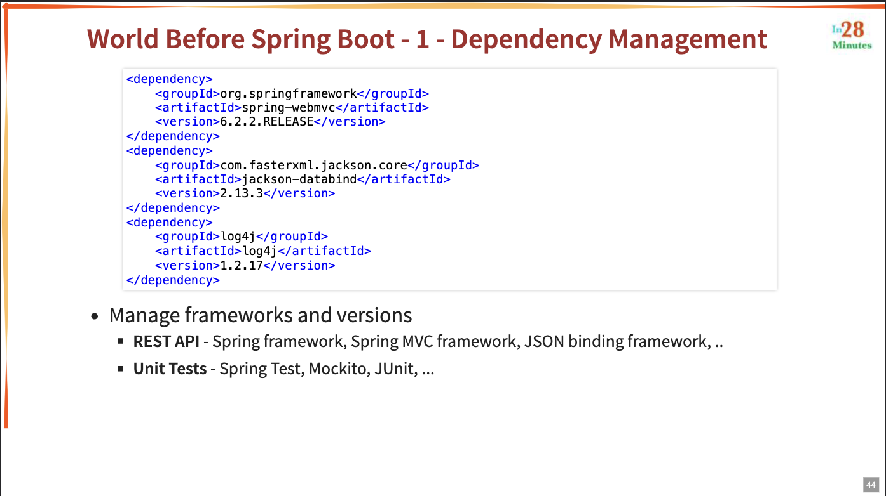
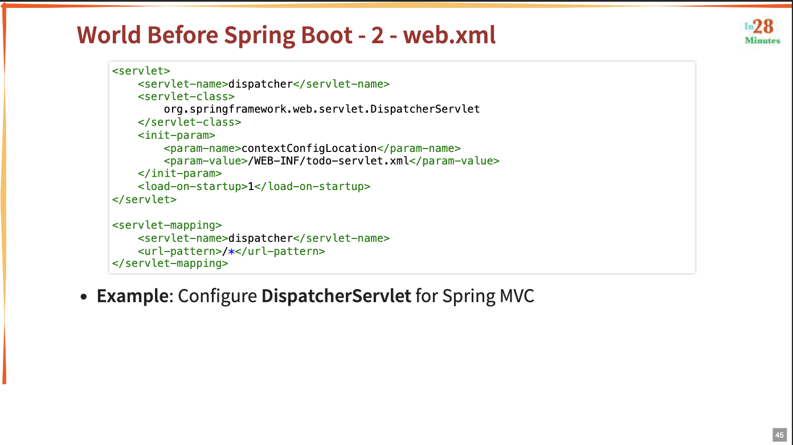
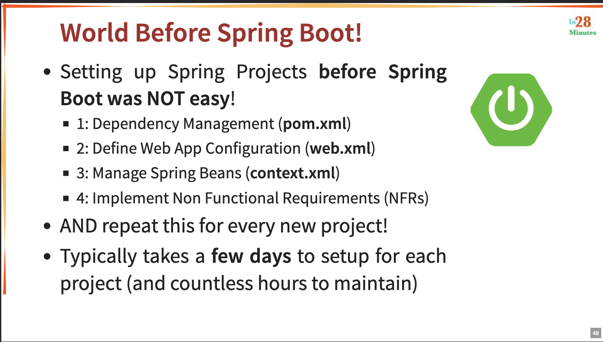

### World Before Spring Boot - 1 Dependency Management    
- Spring:
    - Unittest: - Spring Test, Mockito, JUnit, ...
    - REST API: - Spring MVC, JSON Binding API, ...

- Spring Boot:
    - Container All of above
    - Auto Configuration
    - Starter Projects

---
### World Before Spring Boot - 2 web.xml

- Spring MVC:
    - You need to create web.xml
    - You need to configure DispatcherServlet
    - You need to configure ContextLoaderListener
    - You need to configure Root ApplicationContext
    - You need to configure Servlet ApplicationContext
    - You need to configure DispatcherServlet

- Spring Boot:
    - You don't need to create web.xml
    - Spring Boot automatically creates web.xml
    - Spring Boot automatically creates DispatcherServlet
    - Spring Boot automatically creates ContextLoaderListener
    - Spring Boot automatically creates Root ApplicationContext
    - Spring Boot automatically creates Servlet ApplicationContext
    - Spring Boot automatically creates DispatcherServlet

---
### World Before Spring Boot - 3 Spring Configuration

- Define your Spring Configuration
    - Component Scanning
    - View Resolver
    - Data Source
    - JPA
    - Security
    - ...

---
### World Before Spring Boot - 4 NFRs (Non-Functional Requirements)

- Spring:
    - Logging
    - Monitoring
    - Security
    - ...

- Spring Boot:
    - Logging
    - Monitoring

---
## Summary

